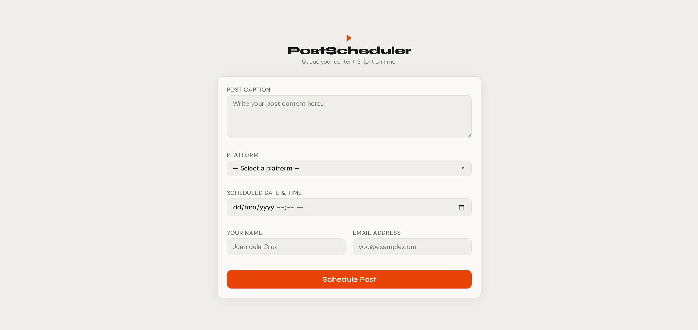

# 📅 Social Media Post Scheduler

A clean, responsive post scheduling web app that sends form data to a Make.com webhook — automatically generating AI hashtags, logging submissions to Google Sheets, and sending a personalized AI-written confirmation email via Gmail.



---

## ✨ Features

- Real-time form validation (empty fields, email format, future date check)
- Loading spinner during submission
- Success and error feedback messages
- No page reload on submit
- AI-generated hashtags based on post caption
- AI-written personalized confirmation email
- Automatic logging to Google Sheets (including AI hashtags)
- Mobile responsive design
- Clean minimalist UI with smooth transitions and hover effects

---

## 🔄 How It Works

1. User fills out the scheduling form (caption, platform, date/time, name, email)
2. Form validates inputs and sends a JSON POST request to Make.com webhook
3. Make.com passes the data to **AI by Make** which generates hashtags and a personalized email
4. Make.com logs the submission + AI hashtags as a new row in Google Sheets
5. Make.com sends the AI-generated confirmation email to the user via Gmail
6. User sees a success message in the browser

---

## 🛠️ Tech Stack

**Frontend:**
- HTML5
- CSS3 (custom variables, animations)
- JavaScript (ES6+, Fetch API)

**Backend / Automation:**
- [Make.com](https://make.com/) — webhook automation
- [AI by Make](https://make.com/) — AI hashtag and email generation (no API key needed)
- [Google Sheets](https://sheets.google.com/) — submission logging
- [Gmail](https://gmail.com/) — AI-powered confirmation email

---

## 📁 File Structure

```
scheduler/
├── index.html    — form structure and markup
├── style.css     — styling, animations, and responsive design
├── script.js     — validation, submission, and UI state logic
└── README.md     — project documentation
```

---

## 🚀 Getting Started

### 1. Clone the repo:
```bash
git clone https://github.com/mors-codes/social-post-scheduler.git
cd social-post-scheduler
```

### 2. Set up Make.com scenario:

**Create a new scenario with these modules in order:**
1. **Webhooks → Custom Webhook** — receives form data
2. **Make AI Toolkit → Simple Text Prompt** — generates hashtags + personalized email
3. **Google Sheets → Add a Row** — logs submission data
4. **Gmail → Send an Email** — sends AI-generated confirmation email

### 3. Configure the AI prompt:

In the **Make AI Toolkit** module, use this prompt:

```
You are a social media assistant. Based on the following post details, do two things:

1. Generate 5 relevant hashtags for the post
2. Write a short personalized confirmation email to the user

Post Details:
- Caption: {{1.caption}}
- Platform: {{1.platform}}
- Scheduled At: {{1.scheduledAt}}
- Name: {{1.name}}

Format your response exactly like this:
HASHTAGS: #tag1 #tag2 #tag3 #tag4 #tag5

EMAIL:
Hi {{1.name}},

Your post has been scheduled successfully!

Caption: {{1.caption}}
Platform: {{1.platform}}
Scheduled At: {{1.scheduledAt}}

[write 1-2 personalized sentences here based on the caption]

Thanks for using PostScheduler!
```

### 4. Configure the webhook URL:

Open `script.js` and replace the placeholder on line 1:
```javascript
const WEBHOOK_URL = "https://hook.us2.make.com/your-actual-webhook-url";
```

### 5. Test it out:

Open `index.html` in your browser — no installs, no build steps, no dependencies.

> Make sure to enable **Scheduling** in Make.com so the scenario runs automatically without clicking "Run once" every time.

---

## 📋 Google Sheets Structure

Create a spreadsheet named `Post Scheduler Log` with these headers in row 1:

| A | B | C | D | E | F | G |
|---|---|---|---|---|---|---|
| Caption | Platform | Scheduled At | Name | Email | Submitted At | Hashtags |

Map each column in Make.com using:
- `{{1.caption}}`, `{{1.platform}}`, `{{1.scheduledAt}}`, `{{1.name}}`, `{{1.email}}`, `{{now}}`, `{{4.answer}}`

---

## 🤖 AI Module Setup

- **Module:** Make AI Toolkit → Simple Text Prompt
- **Model:** Medium (gpt-5-nano)
- **Output variable:** `{{4.answer}}`
- Used in Gmail content and Google Sheets Hashtags column

---

## 🎨 Design Details

- Off-pure colors (no pure black/white)
- Warm off-white background (`#f0eeea`)
- Accent color: burnt orange (`#e8440a`)
- Google Fonts: Syne (display) + DM Sans (body)
- Focus states with orange glow
- Button hover lift effect with shadow
- Feedback messages animate in with `fadeIn`

---

## ✅ Form Validation Rules

| Field | Rule |
|---|---|
| Post Caption | Cannot be empty |
| Platform | Must select an option |
| Scheduled Date & Time | Cannot be empty, must be in the future |
| Your Name | Cannot be empty |
| Email Address | Cannot be empty, must match email format |

---

## 📄 License

This project is open source and available under the [MIT License](LICENSE).